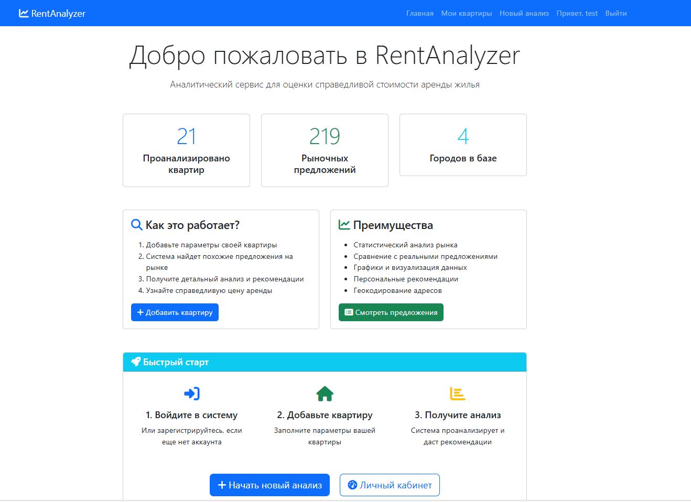
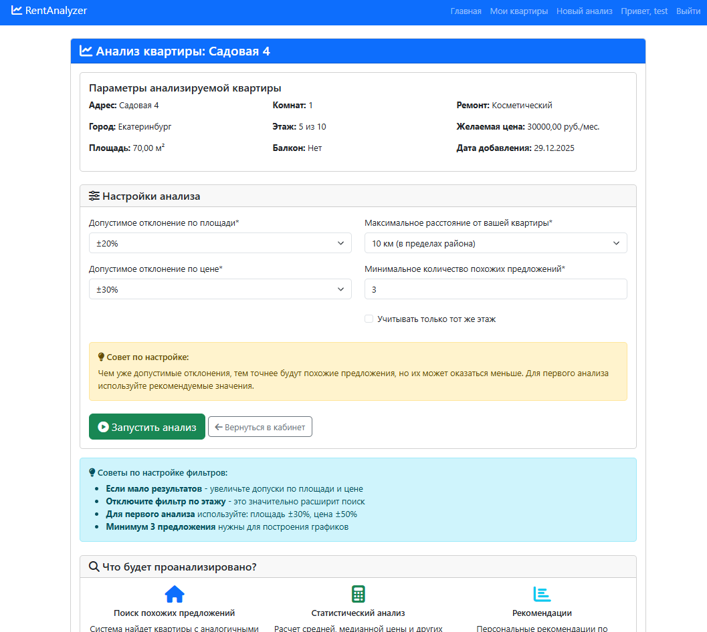
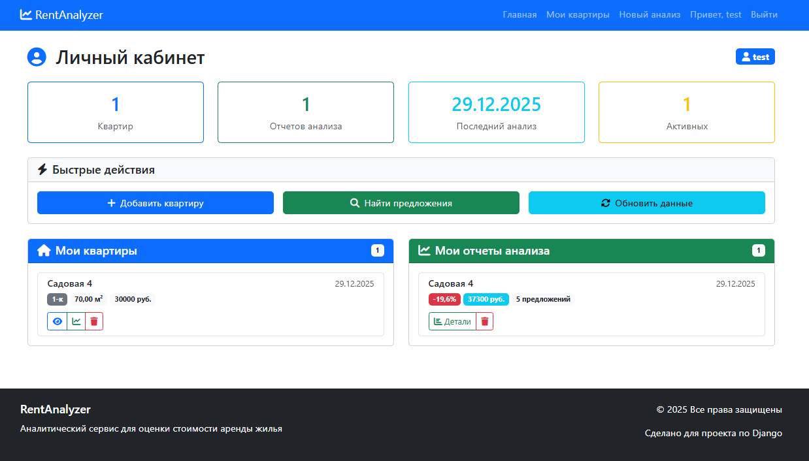
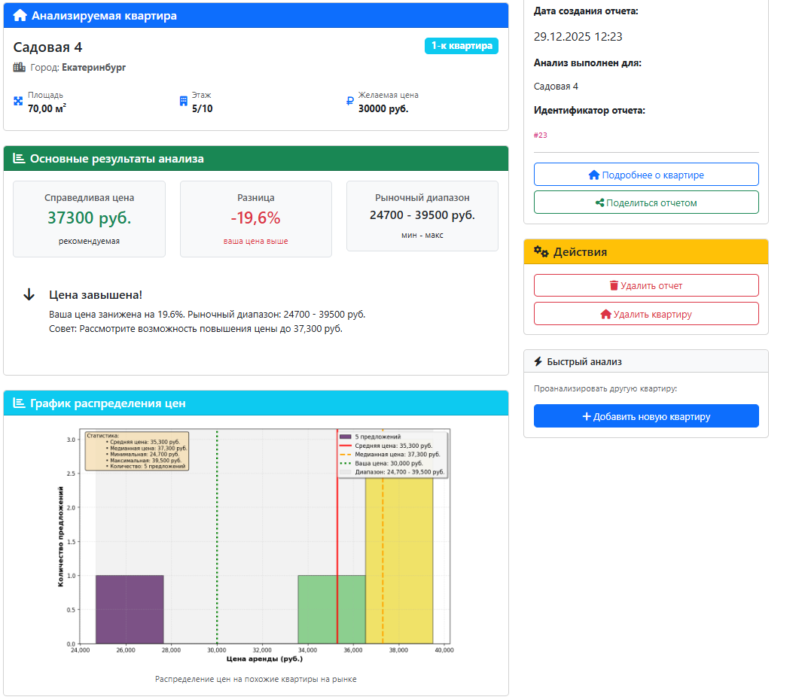

# 🏠 RentAnalyzer
**Аналитический веб-сервис для оценки рыночной стоимости аренды жилья**

RentAnalyzer помогает владельцам недвижимости определить оптимальную цену аренды на основе анализа текущих рыночных предложений. Сервис автоматически находит похожие квартиры, анализирует цены и предоставляет детальные отчеты с рекомендациями.

**🌐 Рабочий проект:** [https://rentanalyzer.pythonanywhere.com]

## 📊 Ключевые возможности

- **Автоматическое геокодирование** адресов через OpenStreetMap API
- **Поиск похожих предложений** с учетом площади, цены, местоположения и расстояния
- **Статистический анализ** рынка (средняя, медианная, мин/макс цены)
- **Визуализация данных** с помощью графиков Matplotlib
- **Личный кабинет** с историей всех анализов
- **Рекомендации** по установке оптимальной цены

## 🛠 Технологический стек

- **Backend:** Python 3.13, Django 4.2
- **Frontend:** Bootstrap 5, HTML5, CSS3
- **База данных:** SQLite
- **Аналитика:** Pandas, NumPy, Matplotlib
- **Внешние API:** OpenStreetMap Nominatim API
- **Дополнительно:** django-crispy-forms, python-dotenv, requests

## 🖼 Скриншоты

### Главная страница

*Приветственный экран с общей статистикой и быстрыми действиями*

### Анализ квартиры

*Страница анализа с графиками распределения цен и статистикой*

### Личный кабинет

*Личный кабинет пользователя с историей анализов и добавленными квартирами*

### Результаты анализа

*Детальный отчет анализа с графиками и рекомендациями*

## 🚀 Как запустить проект локально

### 1. Клонирование репозитория
```bash
git clone https://github.com/danisiomo/rent_analyizer.git
cd rent_analyizer
2. Создание виртуального окружения
bash
python -m venv venv

# Активация для Windows:
venv\Scripts\activate

# Активация для Linux/Mac:
source venv/bin/activate
3. Установка зависимостей
bash
pip install -r requirements.txt
4. Настройка переменных окружения
Создайте файл .env в корне проекта:

env
SECRET_KEY=ваш-секретный-ключ
DEBUG=True
5. Применение миграций
bash
python manage.py migrate
6. Загрузка тестовых данных
bash
python manage.py loaddata fixtures/test_data.json
7. Создание суперпользователя
bash
python manage.py createsuperuser
8. Запуск сервера разработки
bash
python manage.py runserver
9. Открытие в браузере
Перейдите по адресу: http://127.0.0.1:8000

📁 Структура проекта
text
rent_analyizer/
├── config/              # Настройки Django
├── analyzer/            # Основное приложение
│   ├── models.py       # 4 модели данных
│   ├── views.py        # Представления
│   ├── forms.py        # Формы
│   └── management/     # Команды управления
├── users/              # Приложение пользователей
├── utils/              # Вспомогательные модули
│   ├── analyzer.py     # Бизнес-логика анализа
│   ├── charts.py       # Генерация графиков
│   └── geocoder_realistic.py  # Геокодирование
├── templates/          # HTML шаблоны
├── media/              # Медиа файлы
└── static/             # Статические файлы